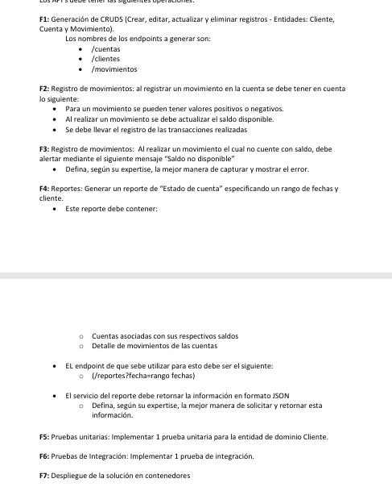

# Reto Bancario por el Ingeniero en Ciencias de la Computación Fabián Garrido

**SE DEBE DAR CLIC Y ESCOGER: EJECUTAR CON BancoCodigo**

**TENER DESHABILITADO LOS SSL EN POSTMAN**

## SSL

# Tiempo utilizado en el desarrollo: 18 horas

## Tecnologías Utilizadas 

- Arquitectura MVC API RESTful o también llamado en BackEnd MRC
- Patrón de Diseño: Inyección de Dependencias
- Visual Studio 2019
- .NET CORE 5.0
- POSTMAN 9.21.2
- SQL Server 2019

## Pruebas de Funcionamiento con Requerimientos

### Información Indicaciones Generales

### Indicaciones Generales

**SE REALIZÓ TODOS LOS ITEMS F1, F2, F3, F4, F5, F6, F7 PARA APLICAR AL PUESTO DE SENIOR**

## Verbos: Get, Post, Put, Delete

## VIDEOS QUE DEMUESTRAN FUNCIONALIDAD

### API CLIENTES Y CUENTAS

**DAR CLIC EN LA IMAGEN PARA QUE LES DIRIJA AL VIDEO**

### API REPORTES

**DAR CLIC EN LA IMAGEN PARA QUE LES DIRIJA AL VIDEO**

### API MOVIMIENTOS

**DAR CLIC EN LA IMAGEN PARA QUE LES DIRIJA AL VIDEO**

### Docker

**DAR CLIC EN LA IMAGEN PARA QUE LES DIRIJA AL VIDEO**

### Arquitectura de Software, patrones de diseño y documentación

**DAR CLIC EN LA IMAGEN PARA QUE LES DIRIJA AL VIDEO**

### TEST UNITARIOS Y DE INTEGRACIÓN

### Diagrama de las Tablas: Clientes, Cuenta, Movimientos con sus respectivas claves primarias

### Funcionalidades

### Pruebas de la Funcionalidad

### Búsqueda por Nombre y Fecha

### Actualización de Saldo

### Validaciones

