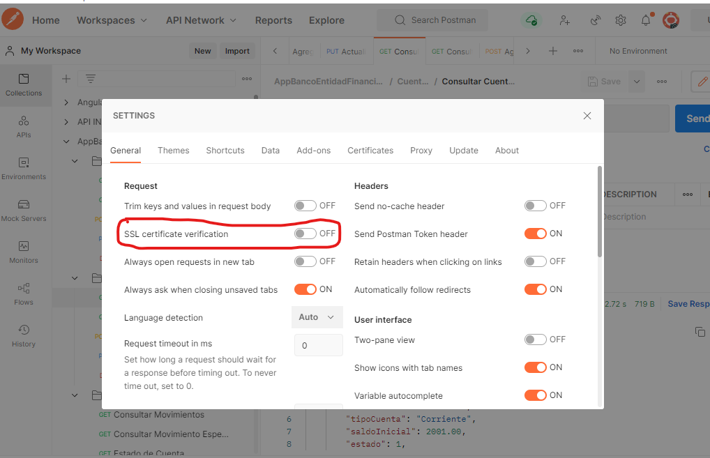
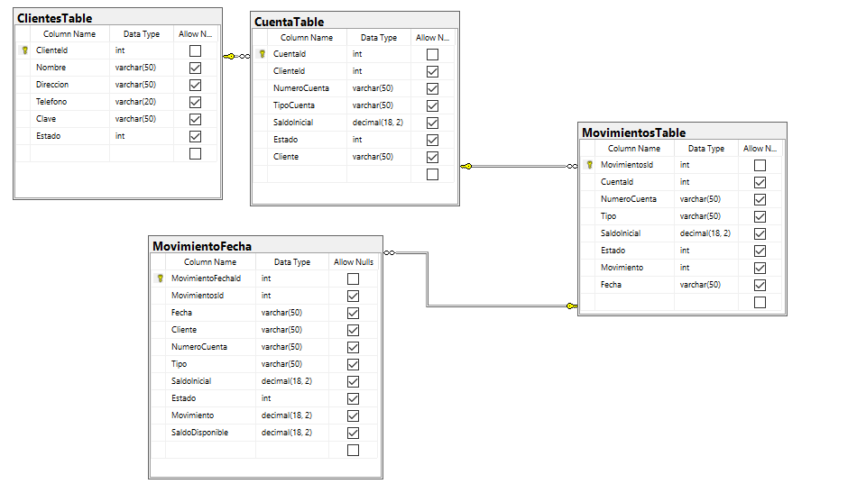
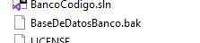
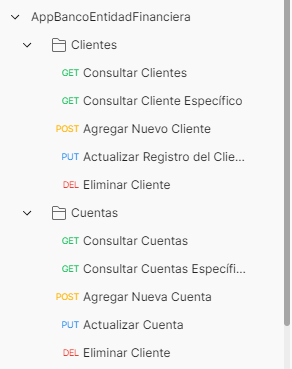
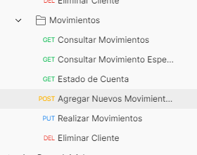
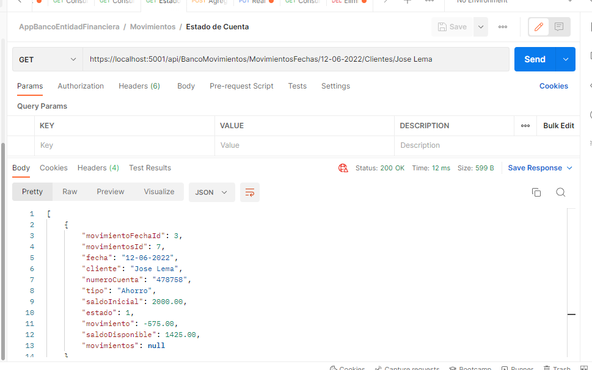
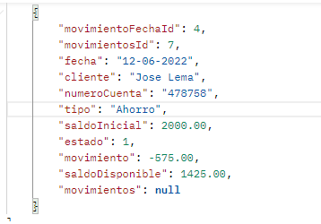
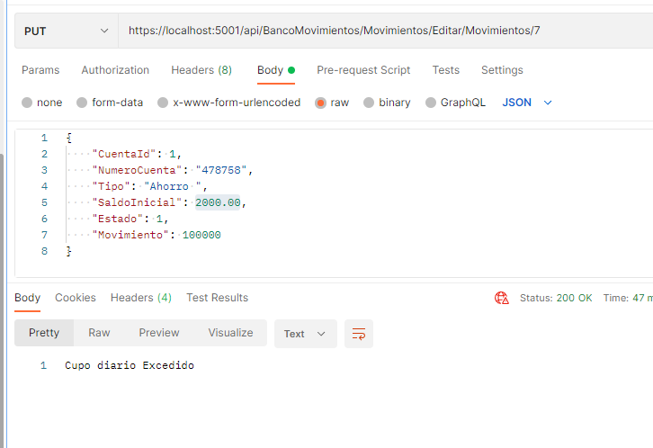
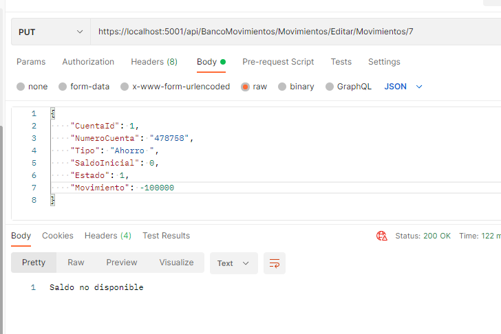

**SE DEBE DAR CLIC Y ESCOGER: EJECUTAR CON BancoCodigo**

**TENER DESHABILITADO LOS SSL EN POSTMAN**

**__SSL__**

# Reto Bancario por el Ingeniero en Ciencias de la Computación Fabián Garrido

# Tiempo utilizado en el desarrollo 18 horas

## Técnologias Utilizadas 

- Arquitectura MVC API RESTful  o también llamado en BackEnd MRC
  
- Patrón de Diseño: Inyección de Dependencias

- Visual Studio 2019
  
- .NET CORE 5.0
  
- POSTMAN 9.21.2

- SQL Server 2019

## Pruebas de Funcionamiento con requerimientos

**__Información Indicaciones Generales__**

**__Indicaciones Generales__**

**SE REALIZO TODOS LOS ITEMS F1, F2, F3, F4, F5, F6, F7 PARA APLICAR AL PUESTO DE SENIOR**

## Verbos: Get, Post, Put, delete 

## VIDEOS QUE DEMUESTRAN FUNCIONALIDAD

**__API CLIENTES Y CUENTAS__**

<video width="320" height="240" controls>
  <source src="BancoEntityFramework/ImagenesReadme/Endpoint_Clientes_y_Cuentas.mp4" type="video/mp4">
  Your browser does not support the video tag.
</video>

**__API MOVIMIENTOS__**

<video width="320" height="240" controls>
  <source src="BancoEntityFramework/ImagenesReadme/Endpoint_Movimientos.mp4" type="video/mp4">
  Your browser does not support the video tag.
</video>

**__API REPORTES__**

<video width="320" height="240" controls>
  <source src="BancoEntityFramework/ImagenesReadme/Endpoint_Reportes.mp4" type="video/mp4">
  Your browser does not support the video tag.
</video>

**__Docker__**

<video width="320" height="240" controls>
  <source src="BancoEntityFramework/ImagenesReadme/Docker.mp4" type="video/mp4">
  Your browser does not support the video tag.
</video>

**__Arquitectura de Software, patrones de diseño y documentación__**

<video width="320" height="240" controls>
  <source src="BancoEntityFramework/ImagenesReadme/Arquitectura.mp4" type="video/mp4">
  Your browser does not support the video tag.
</video>

**__Test pruebas unitarias y de integración__**

<video width="320" height="240" controls>
  <source src="BancoEntityFramework/ImagenesReadme/Arquitectura.mp4" type="video/mp4">
  Your browser does not support the video tag.
</video>

**__Diagrama de la tablas: Clientes, Cuenta, Movimientos con su respectivas claves primarias __**

**__Funcionalidades__**

**__Pruebas de la funcionalides__**

**__Búsqueda por Nombre y fecha__**

**__Actualización de Saldo__**

**__Validaciones__**

